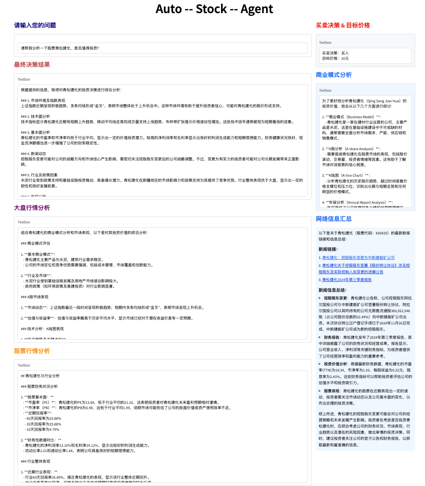
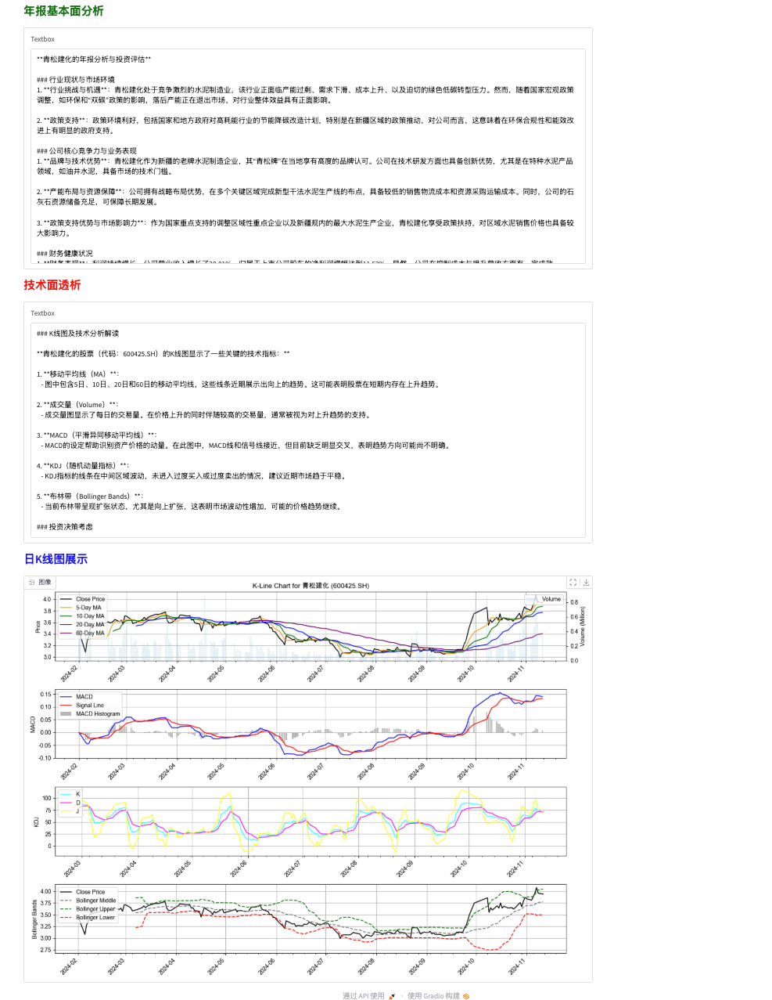

# Auto-Stock-Agent

## Core Idea

```
AutoStock is an advanced framework that integrates diverse data sources to provide a holistic analysis of stock performance and predict future trends.
Designed for investors seeking informed decision-making,
AutoStock combines market information, macroeconomic policies, sentiment analysis, and both fundamental and technical indicators.

```

```
## Market Information Integration

Real-time and historical data on major stock indices and market movements.
Analysis of macroeconomic factors and their impact on the market.

```

```
## Policy & Sentiment Analysis

Keeps you updated with the latest regulatory changes and policy developments.
Utilizes sentiment analysis to gauge market mood from news and social media.

```

```
## Individual Stock Analysis

Tracks performance metrics, including price movements and trading volumes.
Conducts in-depth fundamental analysis of company financials.
Employs technical indicators to identify trends and potential trading signals.

```

```
## Comprehensive Trend Forecasting

Combines all data sources for accurate prediction of stock movements.
Leverages machine learning algorithms for enhanced forecasting capabilities.

```

<p align="center">
    
<p>

<p align="center">
    
<p>


## Quick Start

Preparation

```
prepare your tushare token and openai API key
```

```bash
git clone https://github.com/jackyideal/Auto-Stock-Agent.git
cd Auto-Stock-Agent
pip install -r requirements.txt
python main.py
```


## Citation

If you use Auto-Stock-Agent in your work, please cite this github link in your paper.
